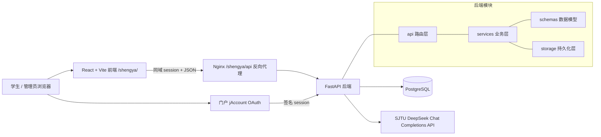
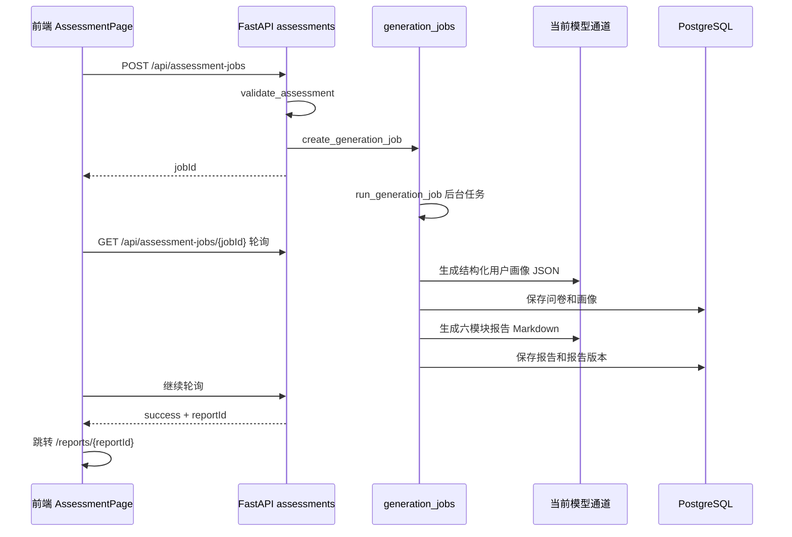
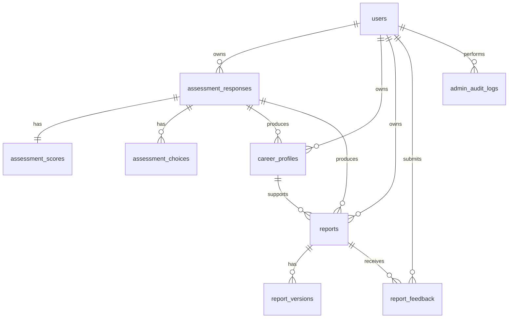

# 大学生生涯规划智能小助手系统实现文档

学生源代码仓库：[labixiaoji/SIYUAN-COMPASS](https://github.com/labixiaoji/SIYUAN-COMPASS)。当前部署版本在其基础上增加了 jAccount、上海交通大学校内 DeepSeek 网关和 `/shengya/` 子路径支持。

## 1. 系统概述

大学生生涯规划智能小助手是一个面向学生的生涯规划问卷与 AI 报告生成系统。系统采用前后端分离架构：

- 前端：React 19 + TypeScript + Vite，负责学生问卷、报告查看、反馈提交和管理员后台。
- 后端：FastAPI + Pydantic + PostgreSQL，负责账号认证、问卷校验、报告生成任务、数据持久化和管理接口。
- 数据库：PostgreSQL 16，核心关系字段单独建列，复杂业务对象以 JSONB 保存。
- 大模型：默认使用上海交通大学模型网关的 DeepSeek Chat Completions API，Kimi 通道仅保留兼容能力；采用“结构化画像生成 -> 六模块报告生成”的两阶段流程。
- 认证：生产环境复用 `ai4edu.sjtu.edu.cn` 门户的 jAccount OAuth 和签名 session，本系统不接触 jAccount 密码。
- 部署：正式环境使用 systemd、PostgreSQL 16 和 Nginx，服务挂载在 `/shengya/`；Docker Compose 保留用于独立部署。

系统的主要使用角色有两类：

- 学生：注册/登录、填写问卷、等待报告生成、查看历史报告、提交报告反馈。
- 管理员：查看全站指标和学生生成记录、查看报告、人工编辑报告标题和正文。

## 2. 技术栈

| 层级 | 技术 | 说明 |
| --- | --- | --- |
| 前端框架 | React 19、React Router | 单页应用，按路由区分学生和管理员页面 |
| 前端构建 | Vite、TypeScript | `npm run dev` 本地开发，`npm run build` 生产构建 |
| 后端框架 | FastAPI | REST API、鉴权依赖、CORS、健康检查 |
| 数据校验 | Pydantic v2 | 请求、画像、报告、任务状态等 schema |
| 数据库 | PostgreSQL + psycopg 3 | 表结构由后端启动时自动创建 |
| AI 调用 | httpx + 校内 DeepSeek API | 默认 `https://models.sjtu.edu.cn/api/v1`，画像阶段启用 JSON mode |
| 统一认证 | jAccount + Flask 签名 session | 复用同域门户 OAuth，映射为本地用户记录 |
| 生产服务 | systemd、Nginx | Nginx 托管前端并反向代理 `/shengya/api` |

## 3. 代码结构

```text
Siyuan-Compass/
  .env.example                  # 唯一环境变量模板
  README.md
  docker-compose.yml
  docker-compose.dev.yml
  siyuan-compass-images-latest-amd64.tar.gz  # 当前离线镜像包
  backend/
    Dockerfile
    requirements.txt
    app/
      main.py                    # FastAPI 应用入口
      core/config.py             # 环境变量配置
      api/                       # HTTP 路由层
      schemas/                   # Pydantic 数据模型
      services/                  # 业务服务、AI 编排、校验逻辑
      llm/provider.py            # Kimi / DeepSeek 通道选择与统一分发
      llm/kimi.py                # Kimi API 客户端
      llm/deepseek.py            # DeepSeek API 客户端
      storage/json_db.py         # PostgreSQL 持久化层
    tests/
      test_postgres_storage_schema.py
  frontend/
    Dockerfile
    nginx.conf
    package.json
    src/
      app/App.tsx                # 前端路由与导航
      auth/                      # 登录状态与路由保护
      api/                       # API client
      pages/                     # 页面组件
      components/                # 表单控件、报告渲染器
      features/assessment/       # 问卷选项配置
      types/                     # 前端类型定义
      styles/global.css
  docs/
```

注意：`backend/app/storage/json_db.py` 当前文件名保留了历史命名，但实际实现已经是 PostgreSQL 存储，不是本地 JSON 文件数据库。

## 4. 总体架构



生产环境下只有前端容器暴露 HTTP 端口。浏览器访问静态页面后，所有 `/api/*` 请求由 Nginx 转发到后端容器。后端不直接暴露到公网。

## 5. 核心业务流程

### 5.1 jAccount 登录与本地开发账号

正式环境的认证流程：

1. 前端跳转 `GET /shengya/api/auth/jaccount/login?next=/assessment`。
2. 后端把安全的站内目标封装为门户 `next`，跳转 `/auth/jaccount/login`。
3. 门户完成 jAccount OAuth，并在 `ai4edu.sjtu.edu.cn` 域写入 Flask 签名 session cookie。
4. 门户跳回 `/shengya/api/auth/jaccount/callback`，本系统验证签名、有效期和用户字段。
5. 后端以 jAccount 名称创建或更新本地 `users` 记录，后续请求通过同域 HttpOnly cookie 鉴权。

修改型 cookie 请求额外校验 `Origin`，降低 CSRF 风险。生涯助手不继承门户管理员名单，所有 jAccount 用户在本系统中均映射为学生。

本地开发仍可启用注册和密码登录：

1. 学生访问 `/register` 或 `/login`。
2. 前端调用：
   - `POST /api/auth/register`
   - `POST /api/auth/login`
3. 后端对用户名做 trim + lower 规范化。
4. 密码使用 PBKDF2-SHA256 加盐哈希，迭代次数为 `210000`。
5. 登录成功后后端返回自定义 HMAC token。
6. 前端把 token 和用户信息保存到 `localStorage`：
   - `siyuan_auth_token`
   - `siyuan_auth_user`
7. 后续 API 请求由 `frontend/src/api/client.ts` 自动附带 `Authorization: Bearer <token>`。

鉴权逻辑在 `backend/app/services/auth.py` 中实现：

- `require_user`：校验 Bearer token 并读取用户。
- `require_admin`：在用户校验基础上检查 `role == "admin"`。

### 5.2 学生填写问卷并生成报告

前端页面：`frontend/src/pages/AssessmentPage.tsx`

当前已完成第一阶段“提交体验与填写反馈”增强：

- 提交前在前端做必填项校验，漏填时显示“还有 N 项未完成”。
- 必填题显示 `*`，漏填字段会红框高亮并显示具体错误文案。
- 自动跳转到第一道漏填题所在步骤，并滚动到对应字段。
- 用户点击提交后禁用提交按钮，防止重复提交。
- 生成中展示清晰阶段：问卷已提交、整理问卷、生成画像、校验画像、生成报告、校验报告、完成。
- 生成失败后展示失败阶段和失败原因，并提供“重新生成”和“返回修改问卷”。
- 问卷草稿自动保存到浏览器 `localStorage`；重新进入问卷页时提示是否恢复草稿。
- 报告生成成功后清除草稿。

当前已完成第四阶段“报告结构升级”增强：

- 结构化画像新增 `Plan C`，用于表达系统建议路径。
- 报告生成由 Plan A / Plan B 双路径升级为 Plan A / Plan B / Plan C 三路径。
- 报告第三模块固定回应“你现在最大的困惑是什么”“这个困惑背后的真正问题是什么”“接下来可以如何验证”。
- 新报告字数目标调整为 5000-6000 字符。
- 报告页底部明显展示“请为本报告评分”入口。
- 管理员后台展示平均理解度、平均启发度、平均行动性、平均推荐度和低分报告列表。

后端入口：

- 异步任务接口：`POST /api/assessment-jobs`
- 任务轮询接口：`GET /api/assessment-jobs/{jobId}`
- 保留同步接口：`POST /api/assessments`

推荐流程使用异步任务：



任务状态由 `GenerationJobStatus` 描述，关键字段包括：

- `status`：`queued`、`running`、`success`、`failed`
- `stage`：当前阶段，例如 `profile_generating`、`report_validating`、`completed`
- `progress`：0 到 100 的前端进度条数值
- `message`：给学生展示的阶段文案
- `responseId`、`profileId`、`reportId`：生成成功后关联业务对象
- `error`：失败原因

当前前端最多轮询 600 次，每次间隔 1 秒；超过约 10 分钟会提示超时。

### 5.3 两阶段 AI 生成流程

报告生成不是直接把问卷发给模型生成最终报告，而是两阶段：

1. 画像生成：`backend/app/services/profile_analyzer.py`
2. 报告生成：`backend/app/services/report_generator.py`

画像阶段：

- 构造 prompt：`backend/app/services/profile_prompt.py`
- 调用当前后端选中的模型通道，开启 JSON mode。
- 解析模型返回 JSON。
- 用 `ProfileAnalysisResult` 校验字段。
- 至少需要包含摘要、动机、优势、风险、路径判断、Plan A / Plan B / Plan C 等任一核心内容。
- 如果 JSON 解析或字段校验失败，会自动重试 1 次，并把失败原因传给模型用于修正。
- 画像可用但辅助字段缺失时，不中断流程，而是写入 `qualityWarnings`。

报告阶段：

- 构造 prompt：`backend/app/services/report_prompt.py`
- 基于原始问卷和结构化画像生成六模块 Markdown 报告。
- 用 `report_quality_check.py` 检查报告结构、Plan A / Plan B / Plan C、最大困惑回应、安全提醒等要求。
- 如果质量检查结果为 `failed`，接口返回错误，不保存备用模板报告。
- 如果质量为 `passed` 或 `warning`，保存报告，同时写入报告版本。

### 5.4 报告查看、历史报告与反馈

学生查看报告：

- 页面：`frontend/src/pages/ReportPage.tsx`
- 接口：`GET /api/reports/{reportId}`
- 权限：学生只能读取自己的报告；管理员可以读取全部报告。

我的报告：

- 页面：`frontend/src/pages/MyReportsPage.tsx`
- 接口：`GET /api/reports/mine`
- 返回当前登录学生的已生成报告和非成功生成任务。
- 页面会展示正在生成、生成失败、已取消和已生成的记录。
- 有正在生成的任务时，页面会自动轮询刷新进度。
- 学生可通过 `POST /api/assessment-jobs/{jobId}/cancel` 取消自己的 `queued` 或 `running` 任务。
- 已生成报告可通过“修改问卷重新生成”把原问卷内容预填回问卷页，修改后提交会生成新的报告记录。

反馈：

- 页面：`frontend/src/pages/FeedbackPage.tsx`
- 接口：`POST /api/reports/{reportId}/feedback`
- 评分字段：
  - `understandingScore`
  - `insightScore`
  - `actionScore`
  - `recommendScore`
- 每个评分必须是 1 到 5 的整数。

### 5.5 管理员后台与人工编辑

管理员后台页面：`frontend/src/pages/AdminPage.tsx`

接口：

- `GET /api/admin/metrics`：全站统计指标。
- `GET /api/admin/records`：学生报告生成记录。
- `PUT /api/admin/reports/{reportId}`：编辑报告标题和正文。

管理员编辑报告流程：

1. 管理员从后台进入 `/admin/reports/{reportId}/edit`。
2. 前端先通过 `GET /api/reports/{reportId}` 加载报告。
3. 管理员修改标题或 Markdown 正文。
4. 保存时调用 `PUT /api/admin/reports/{reportId}`。
5. 后端重新计算字数、重新做质量检查。
6. 当前报告被覆盖为管理员编辑版。
7. `report_versions` 写入新版本，source 为 `admin_edit`。
8. `admin_audit_logs` 记录管理员操作。

## 6. 后端实现

### 6.1 应用入口

文件：`backend/app/main.py`

主要职责：

- 创建 FastAPI 应用。
- 注册 CORS 中间件。
- 提供 `/health` 健康检查。
- 启动时执行：
  - `ensure_storage()`：创建数据库表和索引。
  - `ensure_admin_account()`：如果管理员账号不存在，则用环境变量创建管理员。
- 挂载路由：
  - `auth_router`
  - `assessments_router`
  - `reports_router`
  - `feedback_router`
  - `admin_router`
  - `llm_router`

### 6.2 配置

文件：`backend/app/core/config.py`

配置类：`Settings`

后端配置固定读取项目根目录 `.env`，路径由 `backend/app/core/config.py` 内的 `ROOT_ENV_FILE` 计算得到。这样从 `backend/` 目录本地运行 `uvicorn`、从项目根目录运行测试、或通过 Docker Compose 启动时，都使用同一份环境配置。

主要环境变量：

| 变量 | 用途 |
| --- | --- |
| `LLM_PROVIDER` | 后端模型通道，可选 `deepseek` 或 `kimi`，默认 `deepseek` |
| `KIMI_API_KEY` | Kimi API Key，选择 Kimi 时必需 |
| `KIMI_BASE_URL` | Kimi API 地址，默认 `https://api.moonshot.cn/v1` |
| `KIMI_MODEL` | 模型名，默认 `kimi-k2.6` |
| `DEEPSEEK_API_KEY` / `AI_API_KEY` | DeepSeek API Key；服务器优先复用校内通用变量 |
| `DEEPSEEK_BASE_URL` / `AI_API_BASE` | DeepSeek API 地址，默认 `https://models.sjtu.edu.cn/api/v1` |
| `DEEPSEEK_MODEL` | 模型名，默认 `deepseek-chat` |
| `LLM_TIMEOUT_SECONDS` | 大模型请求超时时间 |
| `FRONTEND_ORIGINS` | CORS 白名单，支持逗号分隔 |
| `AUTH_SECRET` | HMAC token 签名密钥 |
| `AUTH_TOKEN_HOURS` | token 有效小时数 |
| `ADMIN_USERNAME` | 首次启动创建的管理员用户名 |
| `ADMIN_PASSWORD` | 首次启动创建的管理员密码 |
| `ADMIN_DISPLAY_NAME` | 管理员展示名 |
| `POSTGRES_DB` | PostgreSQL 数据库名，主要用于 Compose 生成数据库容器配置 |
| `POSTGRES_USER` | PostgreSQL 用户名，主要用于 Compose 生成数据库容器配置 |
| `POSTGRES_PASSWORD` | PostgreSQL 密码，主要用于 Compose 生成数据库容器配置 |
| `DATABASE_URL` | PostgreSQL 连接串 |
| `VITE_API_BASE_URL` | 本地 Vite 前端请求后端 API 的基础地址 |
| `VITE_BASE_PATH` | 前端路由和静态资源基路径，正式环境为 `/shengya/` |
| `LOCAL_AUTH_ENABLED` | 是否开放本地注册和密码登录，正式环境为 `false` |
| `PORTAL_SESSION_SECRET` | 门户 Flask session 签名密钥，仅存服务器密钥文件 |
| `PORTAL_LOGIN_URL` | 门户 jAccount 登录入口 |
| `PUBLIC_APP_URL` | 对外站点 origin，正式环境为 `https://ai4edu.sjtu.edu.cn` |
| `APP_BASE_PATH` | 应用子路径，正式环境为 `/shengya` |
| `HTTP_PORT` | Docker 前端容器暴露到宿主机的端口 |

注意：管理员账号只在账号不存在时创建。数据库已有管理员后，仅修改 `.env` 里的 `ADMIN_PASSWORD` 不会自动更新数据库密码。

### 6.3 API 路由

| 文件 | 路由职责 |
| --- | --- |
| `api/auth.py` | 注册、登录、当前用户 |
| `api/assessments.py` | 问卷提交、生成任务创建和轮询 |
| `api/reports.py` | 报告查询、我的报告、报告重新生成 |
| `api/feedback.py` | 报告反馈 |
| `api/admin.py` | 管理指标、生成记录、报告编辑 |
| `api/llm.py` | LLM 配置状态检查 |

### 6.4 Schema 模型

主要模型：

- `AssessmentResponseInput`：前端问卷提交数据。
- `AssessmentResponse`：入库后的问卷响应，增加 `id`、`userId`、`submittedAt`、`createdAt`。
- `CareerProfile`：结构化用户画像。
- `CareerBlueprintReport`：最终报告。
- `GenerationJobStatus`：异步生成任务状态。
- `ReportFeedback`：学生反馈。
- `AuthUser`、`AuthResult`：登录返回数据。

### 6.5 问卷校验

文件：`backend/app/services/assessment_validator.py`

校验内容：

- 必填字符串字段不能为空。
- 多选字段至少选择 1 项。
- `topValuesRanked` 必须选择 3 项。
- `missingResources` 最多 3 项。
- `careerConfusions` 最多 3 项。
- 分数字段由 Pydantic 限制在 1 到 5。

校验失败时，接口返回 HTTP 400，错误格式为：

```json
{
  "detail": {
    "errors": ["请填写学院和专业"],
    "fieldErrors": {
      "collegeMajor": "请填写学院和专业"
    }
  }
}
```

其中 `errors` 用于兼容通用错误展示，`fieldErrors` 用于前端把后端校验错误映射到具体问卷字段。

### 6.6 大模型客户端

统一入口：`backend/app/llm/provider.py`

客户端：`backend/app/llm/kimi.py` 和 `backend/app/llm/deepseek.py`

实现要点：

- 使用 `LLM_PROVIDER` 在后端选择 Kimi 或 DeepSeek，前端不参与选择。
- 使用 `httpx.AsyncClient` 发起异步请求。
- 请求地址：`{当前通道_BASE_URL}/chat/completions`
- 请求头使用 Bearer API Key。
- Kimi 使用流式返回并在后端聚合正文，DeepSeek 使用非流式返回。
- 画像阶段可传 `json_mode=True`，会附加：

```json
{
  "response_format": {
    "type": "json_object"
  }
}
```

- 如果 API Key 未配置、HTTP 状态码异常、内容为空，都会抛出错误。

## 7. 数据库设计

数据库表由 `backend/app/storage/json_db.py` 中的 `CREATE_TABLES_SQL` 定义，在后端启动时自动创建。

### 7.1 表清单

| 表 | 说明 |
| --- | --- |
| `users` | 用户账号，包含学生和管理员 |
| `assessment_responses` | 问卷主记录和单值答案快照 |
| `assessment_scores` | 能力分、兴趣分 |
| `assessment_choices` | 多选题答案，按题目和顺序拆行保存 |
| `career_profiles` | 结构化生涯画像 |
| `reports` | 当前报告 |
| `report_versions` | 报告历史版本 |
| `generation_jobs` | AI 生成任务状态 |
| `report_feedback` | 学生报告反馈 |
| `admin_audit_logs` | 管理员操作日志 |

### 7.2 关系



### 7.3 存储策略

系统采用“关系字段 + JSONB 快照”的混合存储：

- 需要关联、排序、筛选的字段单独建列，例如 `user_id`、`response_id`、`profile_id`、`created_at`。
- 问卷、画像、报告完整对象保存到 `data JSONB`，便于前端直接读取完整结构。
- 多选题拆到 `assessment_choices`，避免复杂数组字段影响后续统计分析。
- 能力分和兴趣分拆到 `assessment_scores`，便于后续做聚合分析。
- 报告每次生成、重生成或管理员编辑都会写入 `report_versions`。

## 8. 前端实现

### 8.1 应用入口与路由

文件：`frontend/src/app/App.tsx`

主要路由：

| 路径 | 页面 | 权限 |
| --- | --- | --- |
| `/` | 首页 | 公开 |
| `/login` | 登录 | 公开 |
| `/register` | 注册 | 公开 |
| `/assessment` | 问卷填写 | 学生 |
| `/my-reports` | 我的报告 | 学生 |
| `/reports/:reportId` | 报告详情 | 登录用户 |
| `/reports/:reportId/feedback` | 报告反馈 | 学生 |
| `/admin` | 管理员后台 | 管理员 |
| `/admin/reports/:reportId/edit` | 编辑报告 | 管理员 |

路由保护由 `frontend/src/auth/ProtectedRoute.tsx` 实现：

- 未登录用户跳转 `/login`。
- 角色不匹配时，管理员跳转 `/admin`，学生跳转 `/assessment`。

### 8.2 登录状态

文件：`frontend/src/auth/AuthContext.tsx`

实现要点：

- 通过 React Context 保存当前用户。
- token 和 user 存在 `localStorage`。
- `completeLogin` 写入本地存储并更新状态。
- `logout` 清除本地存储。
- `getAuthToken` 供 API client 读取 token。

### 8.3 API Client

文件：`frontend/src/api/client.ts`

职责：

- 拼接 `VITE_API_BASE_URL`。
- 默认发送 `Content-Type: application/json`。
- 自动附带 Bearer token。
- 统一解析错误格式。
- 后端返回 `detail.fieldErrors` 时，会把字段级错误挂到抛出的 `Error.fieldErrors` 上，供问卷页定位具体字段。

默认本地 API 地址为：

```text
http://localhost:8000/api
```

`frontend/vite.config.ts` 设置了 `envDir: "../"`，因此本地 `npm run dev` 会读取项目根目录 `.env`。生产构建时 Dockerfile 将 `VITE_API_BASE_URL` 设为 `/api`，浏览器请求会交给 Nginx 反向代理。

### 8.4 问卷页面

文件：`frontend/src/pages/AssessmentPage.tsx`

问卷分 6 个步骤：

1. 基本信息
2. 教育路径
3. 未来愿景
4. 价值能力兴趣
5. 行动基础
6. 核心困惑

页面包含本地字段级校验、草稿保存/恢复、防重复提交、生成进度轮询、失败重试和返回修改问卷。提交后页面进入生成进度状态，根据任务轮询结果更新进度条和阶段文案。生成成功后清除草稿并跳转到报告详情页。

### 8.5 报告渲染

文件：`frontend/src/components/ReportRenderer.tsx`

后端保存的是 Markdown 风格的报告正文。前端没有引入通用 Markdown 渲染库，而是实现了一个定制解析器：

- 识别一级标题、二级标题、中文章节标题。
- 去除常见 Markdown 标记。
- 将列表和“接下来 6 个月”行动项渲染为专门的 UI 块。
- 对加粗引导词和中文标签做强调展示。

这使报告展示更贴近产品设计，但也意味着报告 prompt 的章节结构变化会影响前端渲染效果。

### 8.6 管理后台

后台页面读取指标和记录：

- `fetchAdminMetrics()`
- `fetchAdminRecords()`

管理员编辑页通过：

- `fetchReport(reportId)` 加载报告。
- `updateAdminReport(reportId, title, content)` 保存修改。

保存后当前报告会被覆盖，学生再次打开报告时看到管理员修改后的版本。

## 9. API 一览

### 9.1 认证

| 方法 | 路径 | 说明 |
| --- | --- | --- |
| `POST` | `/api/auth/register` | 学生注册 |
| `POST` | `/api/auth/login` | 登录 |
| `GET` | `/api/auth/me` | 当前用户 |

### 9.2 问卷与生成任务

| 方法 | 路径 | 说明 |
| --- | --- | --- |
| `POST` | `/api/assessment-jobs` | 创建异步报告生成任务 |
| `GET` | `/api/assessment-jobs/{jobId}` | 查询任务状态 |
| `POST` | `/api/assessments` | 同步提交问卷并生成报告，主要用于接口测试 |

### 9.3 报告

| 方法 | 路径 | 说明 |
| --- | --- | --- |
| `GET` | `/api/reports?reportId=...` | 按 query 查询报告，兼容旧调用 |
| `GET` | `/api/reports/mine` | 当前学生的报告列表 |
| `GET` | `/api/reports/{reportId}` | 报告详情 |
| `POST` | `/api/reports/regenerate?reportId=...` | 按 query 重新生成报告 |
| `POST` | `/api/reports/{reportId}/regenerate` | 按 path 重新生成报告 |

### 9.4 反馈

| 方法 | 路径 | 说明 |
| --- | --- | --- |
| `POST` | `/api/reports/feedback?reportId=...` | 按 query 提交反馈，兼容旧调用 |
| `POST` | `/api/reports/{reportId}/feedback` | 按 path 提交反馈 |

### 9.5 管理员

| 方法 | 路径 | 说明 |
| --- | --- | --- |
| `GET` | `/api/admin/metrics` | 管理指标 |
| `GET` | `/api/admin/records` | 报告生成记录 |
| `PUT` | `/api/admin/reports/{reportId}` | 编辑报告 |

### 9.6 系统状态

| 方法 | 路径 | 说明 |
| --- | --- | --- |
| `GET` | `/health` | 后端健康检查 |
| `GET` | `/api/llm/status` | LLM 配置状态 |

## 10. 本地运行

项目只保留根目录 `.env` 作为唯一环境配置文件。本地后端、本地前端和 Docker Compose 都读取这一份配置：

```bash
cp .env.example .env
```

### 10.1 后端

```bash
cd backend
python -m venv .venv
source .venv/bin/activate
pip install -r requirements.txt
uvicorn app.main:app --reload --port 8000
```

后端需要可访问的 PostgreSQL，并正确配置 `DATABASE_URL`。

### 10.2 前端

```bash
cd frontend
npm install
npm run dev
```

本地访问：

```text
前端：http://localhost:5173
后端：http://localhost:8000
接口文档：http://localhost:8000/docs
```

### 10.3 必需环境变量

生产或真实测试至少需要配置：

```text
LLM_PROVIDER=deepseek
AI_API_KEY=
AI_API_BASE=https://models.sjtu.edu.cn/api/v1
AI_MODEL=deepseek-chat
FRONTEND_ORIGINS=
VITE_API_BASE_URL=
VITE_BASE_PATH=/shengya/
VITE_ENABLE_LOCAL_AUTH=false
AUTH_SECRET=
LOCAL_AUTH_ENABLED=false
PORTAL_SESSION_SECRET=
PUBLIC_APP_URL=https://ai4edu.sjtu.edu.cn
APP_BASE_PATH=/shengya
DATABASE_URL=
```

如果缺少当前 `LLM_PROVIDER` 对应的 API Key，画像和报告生成会直接失败，不会生成模板兜底报告。

## 11. 部署与本地开发

### 11.1 ai4edu 正式部署

正式站点：<https://ai4edu.sjtu.edu.cn/shengya/>。

正式环境不使用项目自带 Compose，而是接入服务器现有 Nginx、PostgreSQL、门户认证和模型密钥管理：

```text
/shengya/      -> 127.0.0.1:18121 静态前端
/shengya/api/  -> 127.0.0.1:18120 FastAPI
FastAPI        -> 127.0.0.1:5432/siyuan_compass
FastAPI        -> https://models.sjtu.edu.cn/api/v1
```

systemd 同时读取 `/etc/course-ai.env` 和 `/etc/siyuan-compass.env`。前者提供校内 DeepSeek 密钥，后者提供数据库、站点路径及门户 session 配置。生产密钥只存在服务器，权限设为 `0600`。

部署模板位于 `deploy/`。发布前端时必须使用：

```bash
VITE_BASE_PATH=/shengya/ \
VITE_API_BASE_URL=/shengya/api \
VITE_ENABLE_LOCAL_AUTH=false \
npm run build
```

部署后至少检查：静态资源返回 200、`/shengya/api/llm/status` 显示 `deepseek-chat`、jAccount 登录能返回原页面、普通用户不能进入管理员接口、报告生成请求实际调用校内网关。

项目使用两套职责明确的 Compose 文件：

| 文件 | 用途 | 前端 | 数据 volume |
| --- | --- | --- | --- |
| `docker-compose.yml` | 服务器生产部署 | Nginx，宿主机端口 `${HTTP_PORT:-80}` | `postgres-data` |
| `docker-compose.dev.yml` | 本地开发 | Vite，端口 `5173` | `postgres-dev-data` |

两套配置都启动 PostgreSQL、FastAPI 和前端，且都支持通过 `LLM_PROVIDER` 选择 Kimi 或 DeepSeek。

### 11.2 独立 Docker 部署

生产环境使用默认 Compose：

```bash
cp .env.example .env
docker compose up -d --build
docker compose ps
docker compose logs -f backend
```

健康检查：

```bash
curl http://localhost/health
```

更新代码：

```bash
git pull
docker compose up -d --build
```

修改 `.env` 后只需重建对应容器，例如：

```bash
docker compose up -d --force-recreate backend
```

### 11.3 本地开发

本地开发版挂载后端和前端源码，代码修改可热更新：

```bash
docker compose -f docker-compose.dev.yml up -d --build
```

访问地址：

```text
前端：http://localhost:5173
后端：http://localhost:8000
```

停止开发模式：

```bash
docker compose -f docker-compose.dev.yml down
```

如果希望彻底清空开发数据库和前端依赖 volume，可以执行：

```bash
docker compose -f docker-compose.dev.yml down -v
```

注意：只在确认本地开发数据无用时才使用 `down -v`。

## 12. 测试与质量保障

当前仓库包含一个后端单元测试：

```text
backend/tests/test_postgres_storage_schema.py
```

测试内容：

- 确认 PostgreSQL schema 包含预期表。
- 确认多选问卷字段被纳入规范化存储字段列表。

可运行：

```bash
cd backend
python -m unittest discover -s tests
```

当前测试覆盖较轻，主要验证 schema 存在性。高风险扩展建议补充：

- 鉴权测试：学生不能访问他人报告，非管理员不能访问后台。
- 生成任务测试：任务状态从 queued 到 success/failed 的状态迁移。
- 存储测试：保存问卷、画像、报告后能完整读取。
- 管理编辑测试：编辑报告后写入版本和审计日志。
- 前端构建测试：`npm run build`。

## 13. 安全与权限

当前已实现的安全机制：

- 密码不明文存储，使用 PBKDF2-SHA256 加盐哈希。
- token 使用 HMAC-SHA256 签名，并带过期时间。
- 业务接口默认依赖登录用户。
- 学生只能读取自己的任务、报告和反馈入口。
- 管理接口使用 `require_admin` 限制。
- CORS 由 `FRONTEND_ORIGINS` 控制。
- 门户 session 使用 Flask 签名和有效期校验，cookie 修改请求额外校验同源 `Origin`。
- 生涯助手不读取门户的管理员标记，jAccount 用户统一按学生身份进入系统。
- 生产环境关闭本地注册和密码登录，不保存 jAccount 密码及 OAuth access token。

上线前必须处理：

- 修改默认 `AUTH_SECRET`。
- 如果启用本地账号，修改默认管理员密码；正式环境保持本地账号关闭。
- 使用 HTTPS。
- 保护 `.env`，不要提交真实 API Key 和数据库密码。
- 定期备份 PostgreSQL volume。

## 14. 维护注意事项

1. Prompt 与前端渲染存在结构耦合

   `ReportRenderer` 依赖报告中的中文章节标题、列表和行动项格式。如果修改 `report_prompt.py` 的章节格式，需要同步验证前端报告展示。

2. 画像 schema 是生成质量的第一道边界

   `ProfileAnalysisResult` 决定模型 JSON 输出是否可用。如果新增画像字段，建议同时更新 prompt、schema、质量警告逻辑和报告 prompt。

3. 任务在后端进程内执行

   `generation_jobs.py` 使用 `asyncio.create_task` 在当前 FastAPI 进程内执行任务。生产 Dockerfile 使用 `--workers 1`，避免多 worker 下任务和初始化行为复杂化。若未来并发量上升，建议迁移到 Celery、RQ、Dramatiq 或独立任务队列。

4. 数据库 schema 目前由应用启动时创建

   当前没有 Alembic 迁移。新增表字段时需要谨慎处理已有数据，建议引入正式迁移工具。

5. 报告失败不会生成兜底模板

   这是当前设计选择。选中通道未配置、超时、返回结构不合格都会让任务失败，并把错误暴露给前端。

6. `json_db.py` 命名容易误导

   文件实际是 PostgreSQL 存储层。后续可以重命名为 `postgres_storage.py`，但需要同步所有 import。

## 15. 常见扩展点

### 15.1 新增问卷题目

需要同步修改：

- 前端类型：`frontend/src/types/assessment.ts`
- 前端页面：`frontend/src/pages/AssessmentPage.tsx`
- 选项配置：`frontend/src/features/assessment/options.ts`
- 后端 schema：`backend/app/schemas/assessment.py`
- 后端校验：`backend/app/services/assessment_validator.py`
- 画像 prompt：`backend/app/services/profile_prompt.py`
- 存储层：如果是多选字段，需要加入 `ASSESSMENT_LIST_FIELDS`

### 15.2 修改报告结构

需要同步修改：

- `backend/app/services/report_prompt.py`
- `backend/app/services/report_quality_check.py`
- `frontend/src/components/ReportRenderer.tsx`
- 可能还需要调整 `ProfileAnalysisResult.reportEvidenceMap` 的章节映射。

### 15.3 增加管理员能力

建议复用：

- 后端 `require_admin`
- `admin_audit_logs`
- 前端 `/admin` 路由和 `api/admin.ts`

例如新增“删除报告”“导出反馈”“查看报告版本历史”，都应写入审计日志。

## 16. 当前实现边界

- 系统没有接入第三方登录。
- 系统没有邮件、短信或找回密码流程。
- 系统没有正式数据库迁移工具。
- 异步任务没有外部队列，进程重启会中断正在执行的生成任务。
- 前端报告渲染是定制 Markdown 子集，不是完整 Markdown 解析。
- 生产部署建议放在 HTTPS 反向代理之后，当前 Compose 只提供 HTTP 服务。
